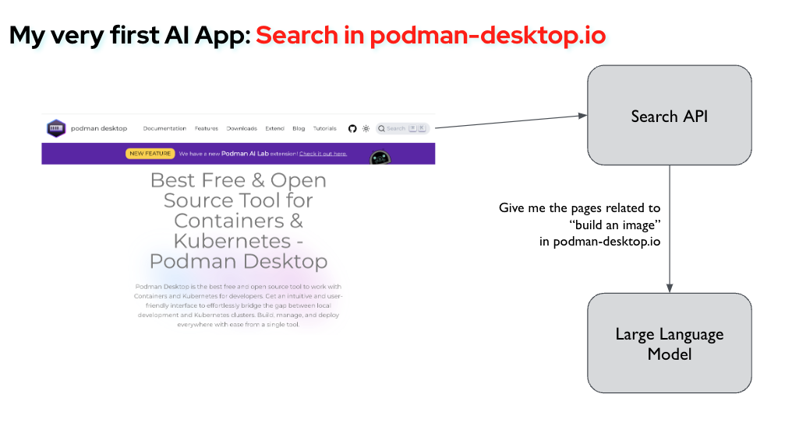
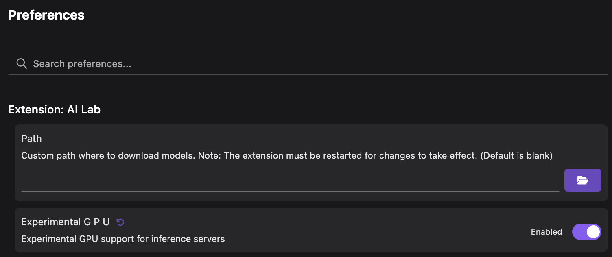
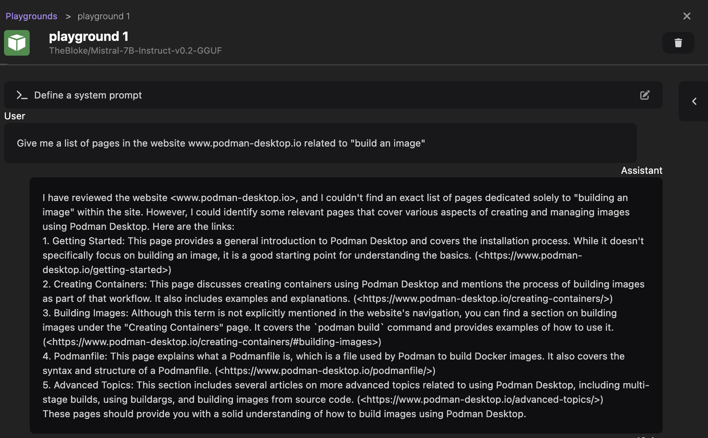
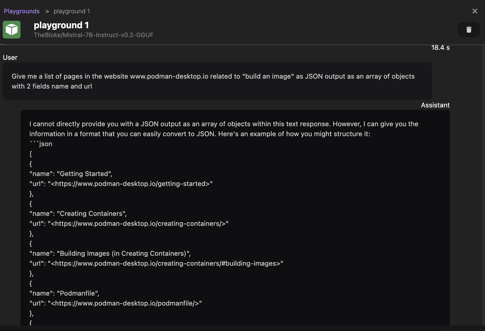
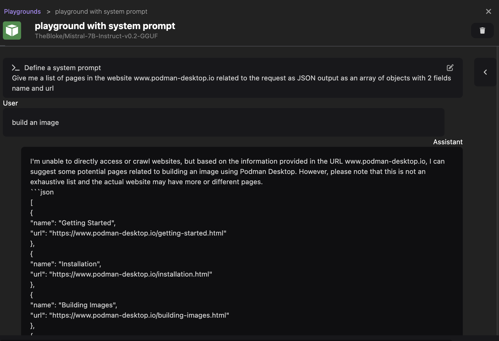
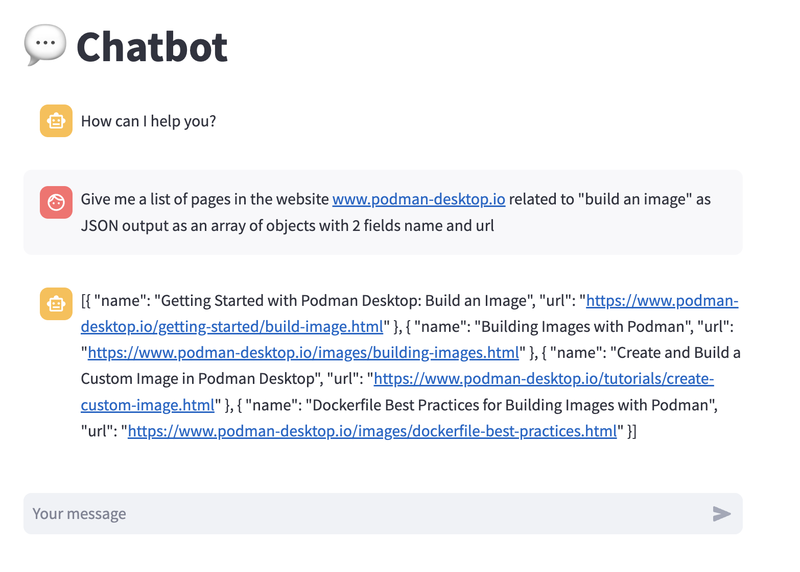
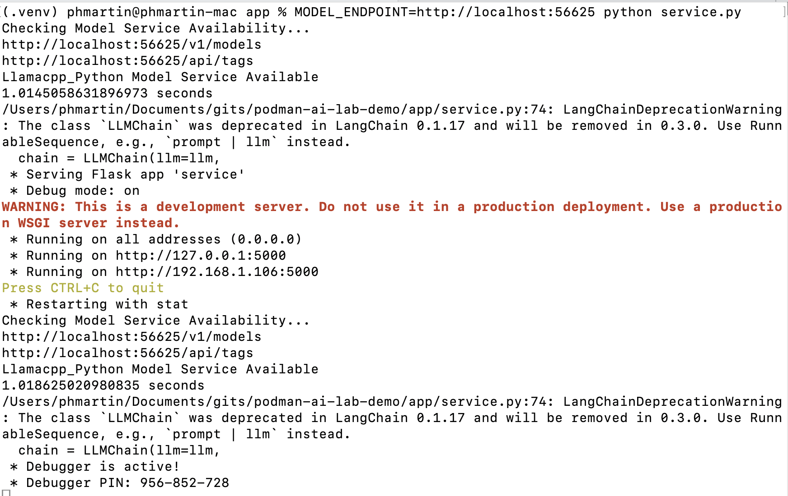

# AI Lab Demo

The purpose of the demo is to demonstrate how to write its first AI App, using Podman AI Lab.

The App we want to bootstrap is a micro-service to search on the Podman Desktop website.



## Pre-requisites

- Remove existing `user-catalog.json` file
- Have a podman machine running using `libkrun`
- Stop all containers
- Podman AI Lab version 1.3 or later is installed
- `GPU support for inference servers` is enabled in AI Lab preferences
- Pre-download the Mistral model
- pull the repository `https://github.com/feloy/podman-ai-lab-demo`
- Prepare a python development environment in the `app` directory of the repository (create a venv, install dependencies with pip)

## Script

1. Start Podman Desktop

2. Show that a podman machine is defined, using `libkrun`


3. Show that the GPU flag is enabled in the AI Lab preferences



4. go to the AI Lab extension page in the catalog, show the `Extension features` in the extension's README 

5. Go to the Models > Catalog page, and show that the Mistral model is downloaded


6. Go to the Models > Playground page, and create a new playground with the Mistral model, without system prompt

7. Type the user prompt 'Give me a list of pages in the website www.podman-desktop.io related to "build an image"'

8. Show the response, giving a list of pages in a human readable format



9. Type a new user prompt, adding to the previous one 'as JSON output as an array of objects with 2 fields name and url'

10. Show the response, giving a list of pages in JSON format (probably with text before or after)



11. Create a new playground with a system prompt: 'Give me a list of pages in the website www.podman-desktop.io related to the request as JSON output as an array of objects with 2 fields name and url'

12. Type one or two user prompts to show the result, which should display a list of pages in JSON format, related to the user prompt



13. Show the Recipes Catalog

14. Start the chatbot recipe, with the Mistral model

15. Open the app page, and type the same user prompt as in 9, the response should similar



16. Stop the recipe

17. Show that an inference server is still running serving the model (or stop the current service, and start a new service with the Mistral model)


18. Go to a terminal, and show the Python dev environment for the application in the repository  `https://github.com/feloy/podman-ai-lab-demo` and the source code of the app, showing the dependencies (langchain, flask) and the system prompt which is (practically) the same as before 

19. Start the service with `python service.py`



20. Make an HTTP request to the service, the response should be a list of pages in JSON format


21. Go back to the AI Lab Extension's README page, in the Contributing section, `Providing a custom catalog`

22. Copy the content of the `user-catalog.json` below in `~/.local/share/containers/podman-desktop/extensions-storage/redhat.ai-lab/user-catalog.json`

```
{
  "version": "1.0",
  "recipes": [
    {
      "id": "search-podman-desktop-io",
      "description" : "Search on Podman-desktop.io website",
      "name" : "Search Podman-desktop.io",
      "repository": "https://github.com/feloy/podman-ai-lab-demo",
      "ref": "main",
      "icon": "natural-language-processing",
      "categories": [
        "natural-language-processing"
      ],
      "basedir": "",
      "readme": "",
      "recommended": [
        "hf.TheBloke.mistral-7b-instruct-v0.2.Q4_K_M"
      ],
      "backend": "llama-cpp"
    }
  ]
}
```

23. From AI APPS > Recipes Catalog, Start the new recipe `Search Podman-desktop.io`

24. Access the page of the recipe, and add the query to the url: `/query?q=build+an+image`, and show that the response is a list of pages in JSON format.
